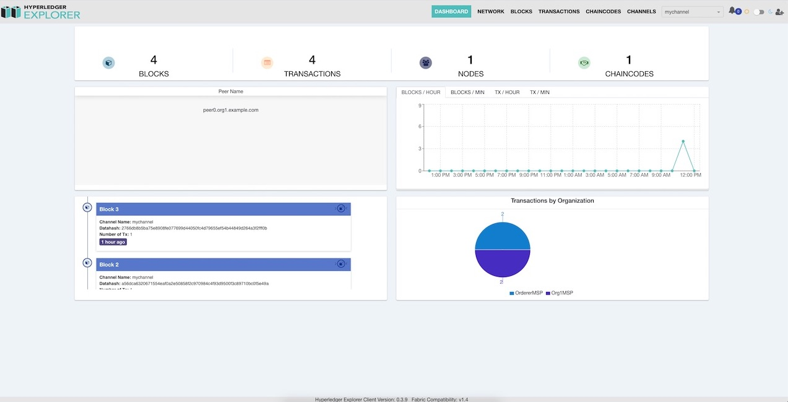
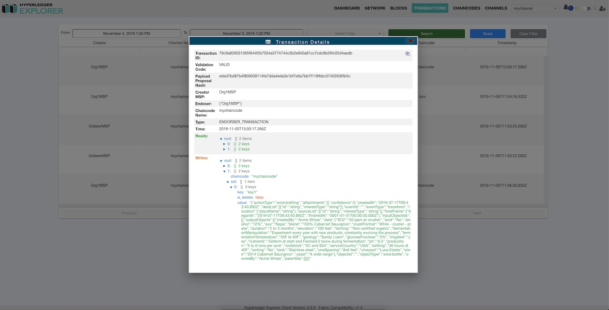

Have you always wanted to learn how to use Hyperledger Fabric but never knew where to start from?

Meet Fabkit (Hyperledger Fabric Toolkit): your best mate to dive you in 😎

## Prerequisites

- [Docker](https://www.docker.com/get-started) [>= 18.05]
- [Docker-compose](https://www.docker.com/get-started) [>= 1.24]

## Install

In order to run commands with ease, we recommend to add `fabkit` as an alias in your default shell profile.

```bash
bash <(curl -sL tinyurl.com/yrenublr)
```

or, if you prefer to perform this step manually, check below what lines you will need to add to your shell profile `.profile`, `.bashrc`, `.zshrc` or similar.

For Linux and Mac users:

```bash
# Fabkit stuff
export FABKIT_ROOT="${HOME}/.fabkit"
alias fabkit="${FABKIT_ROOT}/fabkit"
alias fk="fabkit"
```

For Windows and other OS (or if you simply want to run Fabkit in a docker container):

```bash
# Fabkit stuff (with docker!)
export FABKIT_ROOT="${HOME}/.fabkit"
alias fabkit='docker run -it --rm --name fabkit -e "FABKIT_HOST_ROOT=$FABKIT_ROOT" -v /var/run/docker.sock:/var/run/docker.sock -v "$FABKIT_ROOT":/home/fabkit everledgerio/fabkit:latest ./fabkit "$@"'
alias fk='fabkit'
```

Finally source these changes with: `source full/path/of/your/shell/profile`

Note: **this command needs to be executed only once (however, there will be no harm if accidentally you run it again 😉 )**

To purge `fabkit` from your system you can run anytime this simply script:

```bash
bash <(curl -sL https://bitbucket..../fabkit/releases/../uninstaller.sh)
```

## Getting started

Before starting the network, let's first install all the required dependencies:

```bash
fabkit network install
```

## Run the blockchain network

The following command will spin a Hyperledger Fabric network up, generating _channel_ and _crypto_ config at runtime:

```bash
fabkit network start
# or
fabkit network start --orgs 1
```

It will execute the following functions:

- Build and test the chaincode
- Run unit tests
- Generate crypto materials
- Generate genesis block
- Generate default channel configuration files
- Add default peer to join the channel
- Update the channel with anchor peers
- Install the default chaincode into the default peer
- (v1.x) Instantiate the chaincode on the default peer
- (v2.x) Approve, commit and init the chaincode on the default peer and organization

Afterwards, the network will be ready to accept `invoke` and `query` functions.

Run `fabkit help` for the complete list of functionalities.

### Run the network with different configurations

You may want to run the network with multiple organizations or by using customized network and channel profiles.

To run the network in multi-org setup, you can use the `-o|--orgs <org_no>` flag, where `org_no` is a numeric integer:

```bash
fabkit network start --orgs <org_no>
```

Note: **The maximum number of organizations supported at the time of writing is 3.**

Or you might want to run a multi-org setup, in debug mode and on a specific version of Fabric:

```bash
fabkit network start -o 3 -d -v 1.4.9
```

For the full list of params, check the helper by typing `fabkit network`.

**Note: Fabkit will save the options of the last deployed network. To redeploy using the same configurations, simply run `fabkit network start`. To start afresh add the `-r` option to the command.**

## Stop a running network

The following command will stop all the components of your running network while preserving all the stored data into the _data_ directory by default:

```bash
fabkit network stop
```

## Restart a previously running network

The following command will restart a network with the configuration of your last run only if a _data_ directory is found:

```bash
fabkit network restart
```

## Invoke and query

It is possible to use the CLI to run and test functionalities via invoke and query.

**Note:** The function appearing as a string in the first place of the array `Args` needs to be defined in the chaincode and the `request` should be provided as a JSON wrapped into single quotes `'`.

### Invoke

```bash
fabkit chaincode invoke [channel_name] [chaincode_name] [org_no] [peer_no] [request]

# e.g.
fabkit chaincode invoke mychannel mygocc 1 0 '{"Args":["put","key1","10"]}'
```

### Query

```bash
fabkit chaincode query [channel_name] [chaincode_name] [org_no] [peer_no] [request]

# e.g.
fabkit chaincode query mychannel mygocc 1 0 '{"Args":["get","key1"]}'
```

## Chaincodes

To deep dive in all chaincode operations check out the [Working with chaincode](./docs/chaincode.md) section.

## Blockchain Explorer





This code is provided with a graphical blockchain explorer powered by [Hyperledger Explorer](https://github.com/hyperledger/blockchain-explorer) and other useful tools, such as [Grafana](https://grafana.com/) and [Prometheus](https://prometheus.io/), in order to have full control over the data stored in your ledger.

Once the configuration is ready, you can run the explorer (and all the connected tools) with a simple command:

```bash
fabkit explorer start
```

To stop and remove all the running Explorer processes:

```bash
fabkit explorer stop
```

### UI Explorer

- Username: `admin` | Password: `adminpw`

- Host: [http://localhost:8090](http://localhost:8090)

### Grafana

- Username: `admin` | Password: `admin`

- Host: [http://localhost:3000](http://localhost:3000)

Note: If you are using _docker-machine_ replace `localhost` with the docker-machine IP address. You can find this out by running `docker-machine ip`.

## Register and enroll users

Fabkit offers full support to interact with a Fabric CA. To have a complete overview of the all available commands visit the [Fabric CA and user certificates management](./docs/ca.md) page.

## On Ordering service

The consensus mechanism for the Ordering Service so far fully supported by this repo is `SOLO`, however, there is a 1-org configuration made available for `Raft` as well and it can be used by replacing the following variable in the `.env` file:

```bash
FABKIT_CONFIGTX_PROFILE_NETWORK=OneOrgOrdererEtcdRaft
```

Then simply run the network with a single organization:

```bash
fabkit network start
```

All network available configurations can be found under `network/config`. Users can extend them on their own need.

## Benchmarks

Looking for benchmarking your network? Have a look [here](./docs/benchmarks.md).

## Troubleshooting

If you are experiencing any issue, before opening a ticket, please search among the existing ones or refer to the [troubleshooting](./docs/troubleshooting.md) page.

## Contributing (last but not least!)

We, the Fabric's team, are doing our best to put new features on the shelf as soon as they come out and provide the community with a great user experience, however, we are not fulltime dedicated to the job and that is why we need your help!

If you think there are things you will like to see in the next release and you would like to contribute, you are more than welcome!

There are a couple of things you should beware before getting started:

- Check with the team whether this feature has already been / planned to be implemented

- Search if there is any ticket/issue already mentioning the same or similar idea

  - If yes: add your thoughts there

  - If no: open a new ticket and try to be as more descriptive as possible

- Wait for a reply from the team

Do not forget that whatever the outcome of the discussion is going to be, you can always fork this repository and work on your own.

### Working on a task

To start working on a feature, you just need to set the _FABKIT_ROOT_ variable to point to your repository directory as it follows:

```bash
cd /path/of/this/repo
FABKIT_ROOT="$(pwd)"
```

Now all the `fabkit` commands will execute in your repository path.

Once you have done with the changes, simply kill your terminal window. This will reset your _FABKIT_ROOT_ variable to default.
