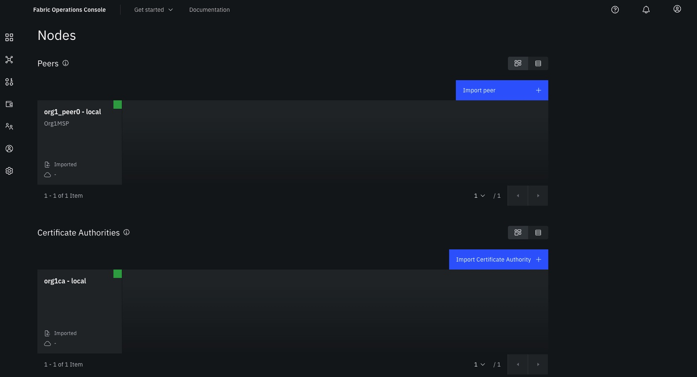
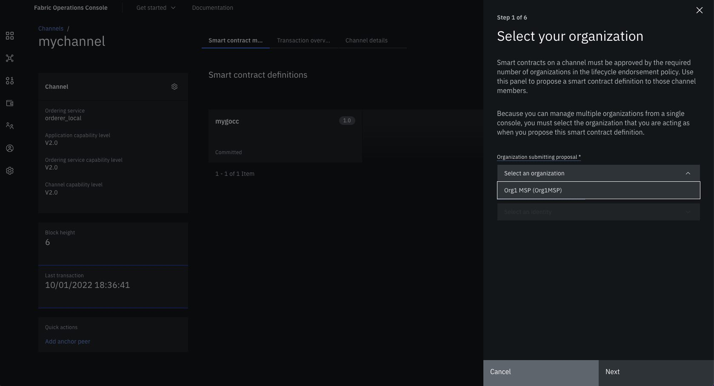

# Fabric Operations Console





The console provides the following high level functionalities:

- Ability to import and manage all Hyperledger Fabric Components from a single web console, no matter where they are located.
- Maintain complete control over identities, channels, and smart contracts.
- Join Peers to Channels and view channel membership as well as individual transactions and channel details.
- Register, view, delete, and re-enroll CA Users.
- View Ordering cluster and node information as well as view and modify consortium and channel membership.
- View and modify channel capabilities and ordering service parameters.
- Install and Instantiate chaincode.  Supports both 1.x and 2.x Lifecycle.
- View, Create, Import and Export Organizations and Identities.
- Role Based Access Control in UI to tightly control which Console users can perform which operations.

To start the console components:

```bash
fabkit console start
```

To stop and remove all console running components:

```bash
fabkit console stop
```

## Accessing the console

- Username: `admin` | Password: `password`
- Host: [http://localhost:3000](http://localhost:3000)

Note: If you are using _docker-machine_ replace `localhost` with the docker-machine IP address. You can find this out by running `docker-machine ip`.

## Setting up

### Access the dashboard

- Open the console at [http://localhost:3000](http://localhost:3000)
- Change the password (only once)
- Access with new credentials

### Import components information

- Access the console dashboard and from the menu on the left, switch to _Settings_ page
- Under _Bulk data management_ click on _Import_
- Select the zip file `console_assets.zip` you will find in `${FABKIT_ROOT}/dist` and click on _Import_

### Create Identities

From the menu on the left, switch to _Nodes_ page and for each component in _Certificate Authorities_ perform the following steps:

- Click on the CA component to access the CA details page
- Click on _Associate Identity_
- Enter enroll id `admin` and secret `adminpw` and click on _Enroll_
- A new _admin_ user will be added to the list
- Select _Register identity_
- Choose enroll id and secret for the admin user that will manage your organization, for example, for Org1MSP, simple mnemonic credentials could be `org1msp-admin` and `org1msp-adminpw`
- Select `admin` under _Type_
- Then click _Next_ and finally on _Register User_
- A new identity will be added to the _Registered Users_ table
- Select the overflow menu (3 dots) on the right of this newly created user
- Select _Enroll identity_
- Use the same secret (e.g. `org1msp-adminpw`) as from step above and then click _Next_
- Enter identity display name as `MSP_ORG_NAME Admin` (e.g. `Org1MSP Admin`) and click _Add Identity to wallet_

The outcome of these steps should be:

- 2 users in the _Registered Users_ table
- User `admin` with _client_ role
- The other user with _admin_ role (**necessary for performing operations on the console**)

### Associate Identity

From the menu on the left, switch to _Nodes_ page and for each peer and orderer component perform the following steps:

- Select a component
- Click on _Associate Identity_
- Select the appropriate `admin` identity (e.g. `Org1MSP Admin` for peers in `Org1MSP`) and click _Associate Identity_

## Data persistency

All components settings and credentials are stored into a CouchDB database and accessible via browser.

- Username: `admin` | Password: `password`
- Host: [http://localhost:5985/_utils/](http://localhost:5985/_utils/)

However, very much in line with web3 hold-your-own-key philosophy, all the private keys of enrolled identities are stored locally in your browser, therefore cleaning up the cache will automatically remove all the entities from your wallet (not from the CA!). If that happens, as long as your remember the _secret_, you will still be able to re-enroll those entities and recover their credentials.
**It is good practice to note the secret down and export those entities from the wallet.**

## References

- [Fabric Operations Console - Official repository](https://github.com/hyperledger-labs/fabric-operations-console)
